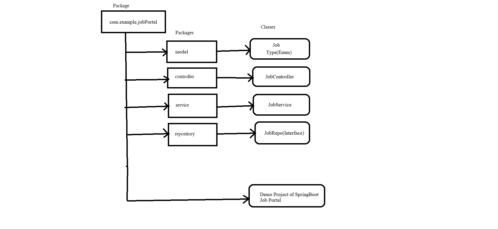
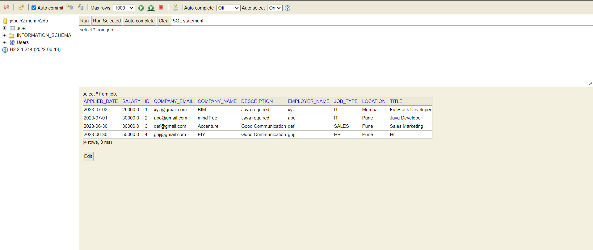

## **Frameworks and language used**
* SpringBoot Framework and java language.
## **Data Flow**

## **Data Structure used in your project**
* Arraylist
* H2 Database
## **Project Summary**

This is "Job Portal" Application which follows MVC-architecture.I have created this project by spring initilizer by taking 5 dependency i.e., lombok, spring web,H2,JPA and Validation. In my model package I have Job class which has all job related data and iny my controller package I have performed 3 task i.e., CRUD operation, custome Finders and @Query, which has help me to understand more about database.

