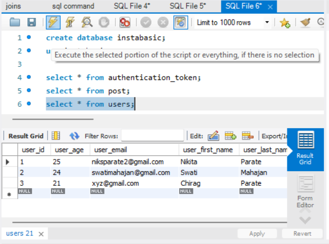

## **Frameworks and language used**
* SpringBoot Framework and java language.
## **Data Flow**

## **Data Structure used in your project**
* Arraylist
* MYSQL Database
## **Project Summary**

This is "Instagram_Basic" Application which follows MVC-architecture.I have created this project by spring initilizer by taking 7 dependency i.e., lombok, spring web,MYSQL,JPA,Swagger,Validation and EmailHandler. In my model package I have Post and User class which has all its related data and in my UserController class I have performed signup,signin and updateUser and in my PostController class I have performed savePost and getPostById.These classes has helped me to create basic Instagram project.

