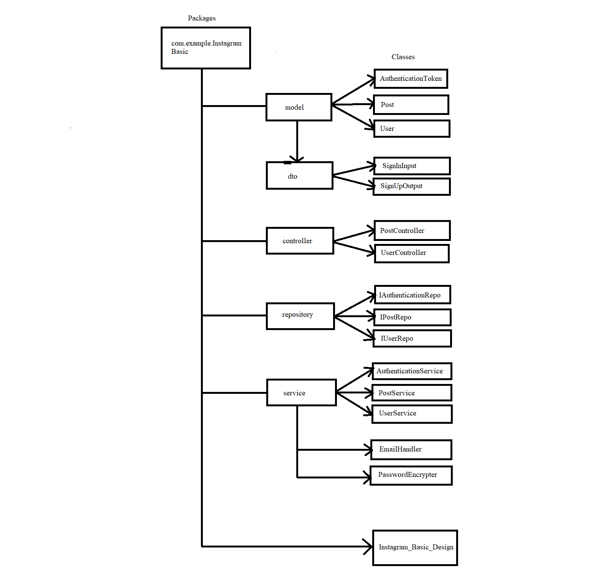

## **Frameworks and language used**
* SpringBoot Framework and java language.
## **Data Flow**

## **Data Structure used in your project**
* Arraylist
* MYSQL Database
## **Project Summary**

This is "Ecommerce_API" Application which follows MVC-architecture.I have created this project by spring initilizer by taking 6 dependency i.e., lombok, spring web,MYSQL,JPA,Swagger and Validation. In my model package I have User,Product,Address and Order class which has all its related data and my controller package I have performed @PostMapping,@GetMapping,@DeleteMapping and call it by using Swagger.

